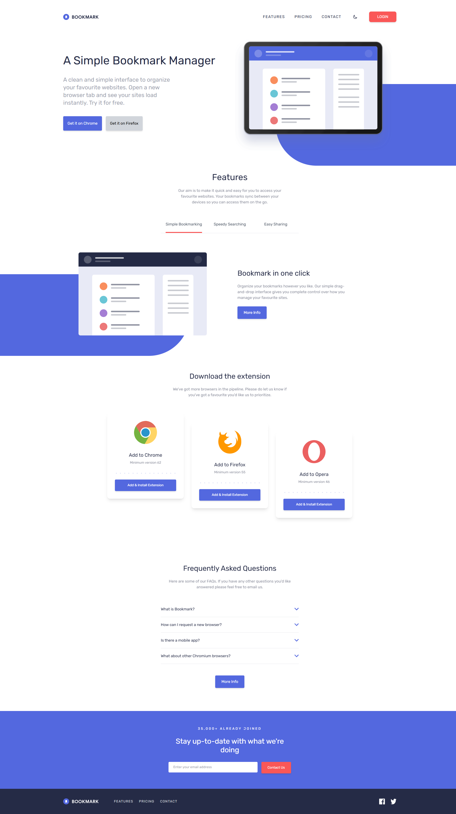

# Frontend Mentor - Bookmark landing page solution

This is my solution to the [Bookmark landing page challenge on Frontend Mentor](https://www.frontendmentor.io/challenges/bookmark-landing-page-5d0b588a9edda32581d29158).

## Table of contents

- [Overview](#overview)
  - [The challenge](#the-challenge)
  - [Screenshot](#screenshot)
  - [Links](#links)
- [My process](#my-process)
  - [Built with](#built-with)
  - [What I learned](#what-i-learned)
  - [Features](#features)
- [Author](#author)

## Overview

### The challenge

Users should be able to:

- View the optimal layout for the site depending on their device's screen size
- See hover states for all interactive elements on the page
- Receive an error message when the newsletter form is submitted if:
- The input field is empty
- The email address is not formatted correctly

### Screenshot



### Links

- Solution URL: [my frontend mentor solution](https://www.frontendmentor.io/solutions/bookmark-landing-page-with-typescript-and-tailwindcss-H_5xzshfI6)
- Live Site URL: [Live Demo](https://qs3h.github.io/Bookmark-landing-page/)

## My process

### Built with

- Semantic HTML5 markup
- CSS custom properties
- Flexbox
- Mobile-first workflow
- [Tailwind CSS](https://tailwindcss.com/) - Utility-first CSS framework
- [TypeScript](https://www.typescriptlang.org/) - Typed JavaScript

### What I learned

This project helped me practice several key concepts:

**1. Tailwind CSS Dark Mode**

Implemented a dark mode toggle that respects system preferences and persists user choice:

```typescript
function getPreferredTheme(): "dark" | "light" {
  const savedTheme = localStorage.getItem("theme");
  if (savedTheme === "dark" || savedTheme === "light") {
    return savedTheme;
  }
  return window.matchMedia("(prefers-color-scheme: dark)").matches
    ? "dark"
    : "light";
}
```

**2. CSS Animations with Intersection Observer**

Created scroll-triggered animations using the Intersection Observer API:

```typescript
const animationObserver = new IntersectionObserver((entries) => {
  entries.forEach((entry) => {
    if (entry.isIntersecting) {
      const element = entry.target as HTMLElement;
      const animationType = element.dataset.animation || "animate-fade-in-up";
      element.classList.add("animated", animationType);
      animationObserver.unobserve(element);
    }
  });
}, observerOptions);
```

**3. Mobile Navigation Overlay**

Built a full-screen mobile menu with smooth animations and proper accessibility:

```css
#mobile-menu.flex {
  animation: fadeIn 0.3s ease-out;
}

#mobile-menu .mobile-nav-link {
  opacity: 0;
  animation: fadeInUp 0.4s ease-out forwards;
}
```

### Features

- ✅ Fully responsive design (mobile, tablet, desktop)
- ✅ Dark mode with system preference detection
- ✅ Smooth scroll navigation
- ✅ Animated tab switching for features section
- ✅ FAQ accordion with smooth expand/collapse
- ✅ Email validation with error states and shake animation
- ✅ Scroll-triggered animations (fade in, slide in, scale up)
- ✅ Mobile navigation overlay with animated menu items
- ✅ Hover effects on cards, buttons, and links
- ✅ Accessible focus states

## Author

- Frontend Mentor - [@QS3H](https://www.frontendmentor.io/profile/QS3H)
